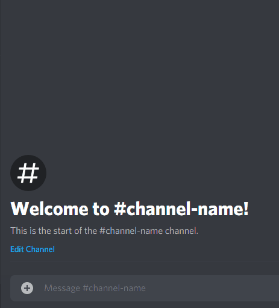

# Fellowbook

  [](https://opensource.org/licenses/MIT)     

<p align="center">
    <a href="https://mlhfellowbook.herokuapp.com">
        
    </a>
</p>

<p align="center">
    June 5th, 2020 - <a href='https://fellowship.mlh.io/'>MLH Fellowship</a> Orientation Hackathon Project<br>
    by <a href='https://github.com/shu8'>Shubham Jain</a>, <a href='https://github.com/kendevops'>Kenneth Aladi</a> and <a href='https://github.com/ivov'>Iván Ovejero</a>.
</p>

## What?

**Fellowbook is a whimsical data stream of all your 120 fellow fellows, made available with a snappy 24/7 chatbot :robot: and a picture-based directory web-app :green_book:**

—Tagline: Your fellows at your fingertips!

<p align="center">
    
    
</p>

## Why?

**Problem**: How in the world do you keep track of all +120 fellows in your head? Way too many! It's like a Russian novel! Help! :astonished:

**Solution**: We stream the fellows you need whenever you need them. We'll source, sort, summarize and quantify everyone for the entire summer, for 2020 and upcoming years! :fire:

- For people with goldfish memory, who can only keep 7±2 people in their heads at all times! :grimacing:
- For people who're just too lazy for lookups! Sometimes you just want someone's numbers at a glance! :star:
- For people who know that popularity contests and checking each other out is always where it's at! :heart:

<p align="center">
    People love it!<br>
    <br>
    
</p>

And yes, the bot awards you extremely valuable **popularity points**.

→ If you want to check yours, you're free to do so in the MLH server **right now!**

→ If you want to know what they mean, this is open source, so **you know what to do!**

## How?

In the MLH Discord, type `!gimme githubUsername` and our snappy fellowbot will hand you a summary of everything it knows about them: name, repos, followers, bio, location, assigned pod, and those oh-so-rare popularity points! :stuck_out_tongue_closed_eyes:

<p style="display:flex; justify-content:space-around">
    
    
</p>

Or if you just gotta catch 'em all, just hop on over to [the MLH Fellowbook web-app](https://mlhfellowbook.herokuapp.com) to explore the full ~~Face~~Fellowbook web app. Follow your fellows!


## Tech!

We're excited to have used lots of open-source tech to create Fellowbook!

### Backend

<p align='center'>
    
</p>

We collected public data from Github API endpoints, retrieving stats as well as personal data and sundry bits of information, and then we populated it into an AWS Amplify DynamoDB instance.

- Github APIs (the [v3 REST API](https://developer.github.com/v3/) and the [v4 GraphQL API](https://developer.github.com/v4/)) → **Big props** to our core data provider!
- [AWS Amplify](https://aws.amazon.com/amplify/) → Tech with the **MLH Stamp of Approval®**!
  - [Amazon DynamoDB](https://aws.amazon.com/dynamodb/) to securely store Fellow data
  - [Amazon API Gateway](https://aws.amazon.com/api-gateway/) to access Fellow data, using Amazon's awesome [custom API Authorizers](https://aws.amazon.com/blogs/compute/introducing-custom-authorizers-in-amazon-api-gateway/) and our own lambda to authorise users
  - [Amazon Lambda](https://aws.amazon.com/lambda/) for effortless server-side Node.js code!

<p align="center">
    
    
    
</p>

### Fellowbot

<p align="center">
    
</p>

We created a Discord bot ready to answer commands and crunch up mini-reports based on the data we fetched, then we hosted it on Heroku, and let it loose in the official MLH Discord server for people to discover and play around with.

- [Discord.js](https://discord.js.org) → **Chosen by MLH**, chosen by us!
- [Node.js](https://nodejs.org/en/) → insanely easy and quick to setup server!
- [Heroku](https://heroku.com/) → Big props too! Lifesaver on auth!

<p align="center" style="display:flex; justify-content:space-around">
    
    
    
</p>

### Directory

<p align="center">
    
</p>

We presented all this data for easy exploration with a React web-app created with Facebook's [`create-react-app`](https://github.com/facebook/create-react-app), including search functionality, and cherrypicking only the most flattering pictures of all fellows! (Or abstract geometric images as sane defaults.). All quickly deployed on [Heroku](https://heroku.com/)!

- [React](https://reactjs.org/) → Tech with the **MLH Stamp of Approval®**!
- [Babel](https://babeljs.io/) → Tech with the **MLH Stamp of Approval®**!
- [Styled Components](https://styled-components.com/) → For the :heart: of **beautiful UI**!

<p align="center">
    
    
    
</p>

We created our own [GitHub OAuth App](https://developer.github.com/apps/building-oauth-apps/) so users can login with GitHub to authenticate themselves to use the web-app &mdash; non-Fellows can't peak!

We initiate the GitHub's [OAuth authorisation process](https://developer.github.com/apps/building-oauth-apps/authorizing-oauth-apps/) ourselves to get an access token, which is used to confirm you are part of the [MLH Fellowship GitHub organisation](https://github.com/MLH-Fellowship/).

## Development setup

There are lots of parts to this project! The main repository is split into:

### [AWS backend](./aws-backend)

Most of these files are auto-generated by the [`amplify` CLI tool](https://github.com/aws-amplify/amplify-cli).

To get started, you'll need to install and use `amplify`:

```
cd aws-backend
npm install -g @aws-amplify/cli
amplify configure
amplify init # to create your own project
amplify deploy
```

The files you will usually be interested in are:

1. `aws-backend/amplify/backend/function/fellowsEndpoint/src/app.js` (our `/fellows` AWS API endpoint routes)
2. `aws-backend/amplify/backend/function/githubauth/src/index.js` (our custom API Authorizer function to ensure users are MLH Fellows)
3. `aws-backend/amplify/backend/api/api-params` (our AWS API parameters)

### [Discord bot](./discord-bot)

This contains the server for the Discord Bot, to use:

```
cd discord-bot
npm install
node index.js # to host locally
```

You'll also need a `.env` file containing `BOT_TOKEN=[your Discord bot token]` and `GITHUB_LOGIN_TOKEN=[your Github API access token]`.

### [GitHub API logic](./github-api)

This contains the Node.js scripts used to populate the AWS database of fellows. To use:

```
cd github-api
npm install
node fetcher.js # to get all relevant data from the GitHub API & save to our remote db
```

You will need a `.env` file containing `GITHUB_TOKEN=[your GitHub API access token]`.

### [Heroku server dyno](./heroku)

This contains the simple Node.js Express server that is hosted on Heroku serving the static built React web app. To use:

```
cd heroku
npm install -g heroku
heroku login # complete the login process
heroku create # if you want to deploy it yourself
git commit -am "Commit message" # make changes and commit to heroku master
git push heroku master # deploy changes
```

To deploy the static site, you'll need to add the static files to the `heroku/web` folder (use `git add ... -f`).

See [Heroku's excellent documentation](https://devcenter.heroku.com/articles/getting-started-with-nodejs) for more details.

### [React web-app](./web)

This contains the React web app files, currently hosted at mlhfellowbook.herokuapp.com. To use:

```
cd web
npm install
npm run-script start # to serve locally
npm run-script build # to build the site
```

To deploy, follow the steps at the end of the Heroku server dyno instructions!

## Anything else?

Remember the rules!

It's _not_ about:

- how good your code is,
- how novel the idea is, or
- how useful the project is.

It _is_ about:

- **Impressive**: People's wows are on record! Check Discord!
- **Design**: Slick UI with search and a snappy bot 24/7!
- **Completion**: No pending functionality, our hack works!
- **Learning**: AWS, CORS and auth are always tough!
- **OSS practices**: Plentiful commits, issues, branches, PRs!
- **Approved tech**: Many projects integrated into one!

In short:

> _Sometimes a pointless project is one of the best hacks!_<br> [—MLH Hackathon Rules](https://github.com/MLH-Fellowship/fellows-0/blob/master/orientation-hackathon/rules.md)
