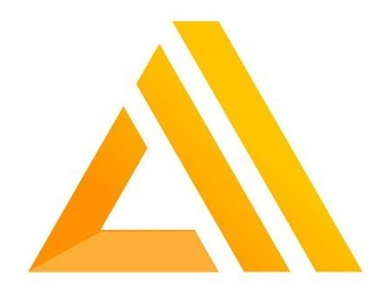

# Fellowbook®

  

June 5th - MLH Hackathon Project Submission by Shubham Jain, Kenneth Aladi and Iván Ovejero

—Tagline: Your fellows at your fingertips!—

**Fellowbook is a whimsical data stream of all your 120 fellow fellows, made available with a friendly little chatbot :robot: and an image-based directory app :green_book:**

> **Problem**: How in the world do I keep all these 120 characters straight? It's like a Russian novel! :astonished:

> **Solution**: We stream the people you need whenever you need them. We'll source, sort and summarize everyone for the entire summer, of this and upcoming years! :fire:

In the MLH Discord, type `!gimme username` and our friendly fellowbot will hand you a summary of everything she knows about them, from repos to popularity points! :stuck_out_tongue_closed_eyes:

[GIF showing Discord bot goes here]

Or just hop on over to [WEB_APP_URL] to explore the full ~~Face~~Fellowbook, and to look them up before they realize you're struggling to remember their name!

[GIF showing React app goes here]

## Tech

### Data

We collected data from multiple Github API endpoints, retrieving various stats as well as personal data made public and sundry odds and ends, and then we populated it into an AWS Amplify DynamoDB instance.

- [Github API](https://developer.github.com/v3/)
- [AWS Amplify](https://aws.amazon.com/amplify/)
- [DynamoDB](https://aws.amazon.com/dynamodb/)

    
    
    

[BACKEND_SCREENSHOT_GOES_HERE]

### Fellowbot

We created a Discord bot ready to answer commands in all channels, prepared mini-reports based on all the data we fetched, hosted it on Heroku, and got permission to let it loose in the official MLH Discord server.

- [Node.js](https://nodejs.org/en/)
- [Discord.js](https://discord.js.org)
- [Heroku](https://heroku.com/)

    
    
    

[DISCORD_SCREENSHOT_GOES_HERE]

### Directory

We prettified and presented all this data for ease of exploration with a slick user interface and cherrypicked only flattering pictures of all fellows! (Or abstract geometric images as sane defaults.)

- [React](https://reactjs.org/)
- [Babel](https://babeljs.io/)

    
    

[APP_SCREENSHOT_GOES_HERE]

---

[DECIDE_ON_THIS_STUFF]

Are we excluding these...?

- sheet.js (?)
- n8n.io (?)
- Docsify (?)

---

## Motivation

Why?

- For people with the memory of a goldfish, who can only keep 7±2 people in their heads at all times! :grimacing:

- For people who're just too lazy for lookups! Sometimes you just want someone's numbers at a glance! :star:

- For people who know, deep down, that vain popularity contests is always where it's at! :heart:

- And finally, we're pandering to our base! Cramming as much of the backers' tech as we can, to fulfill stringent MLH requirements, to help fellows check each other out! :relaxed:

## Anything else?

Remember the rules!

It's not about:

- how good your code is,
- how good the idea is, or
- how useful the project is.

> Sometimes a pointless project is one of the best hacks!  [—MLH Hackathon Rules](https://github.com/MLH-Fellowship/fellows-0/blob/master/orientation-hackathon/rules.md)
